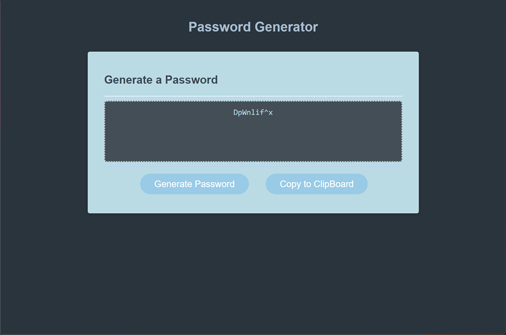

  
  # Password Generator
  
  ## Table of Contents
  * [Description](#description)
  * [Technologies](#technologies)
  * [Installation](#installation)
  * [Usage](#usage)
  * [Contributing](#contributing)
  * [Guidelines](#guidelines)
  * [Tests](#tests)
  * [License](#license)
  * [Questions](#questions)
---

  ## Description
  Very simple secure password generator created using JavaScript. User clicks on "generate password" button and is then prompted to define parameters for desired password - min/max length, uppercase/lowercase, and the inclusion of numbers and/or symbols. Once generated user can click on "copy" button that copies password to clipboard

  ## Technologies
   * HTML
   * Water.css
   * JavaScript
   
  ## Installation
   No installation required, visit the URL to use.

  ## Usage
   Application can be used [here](https://mleftwich.github.io/PasswordGenMagic/).

  ## Contributing
   Reach out through the email listed below.

  ## Guidelines
   Consider using a password manager to store generated passwords.

  ## Tests
   Tests conducted in development.

  ## License
   Licensed under [MIT](https://opensource.org/licenses/MIT) 

   ---

  ## Questions
   For any questions you can find me at [GitHub](https://github.com/mleftwich) or email me at [mleftwich@live.com](mailto:mleftwich@live.com) 

